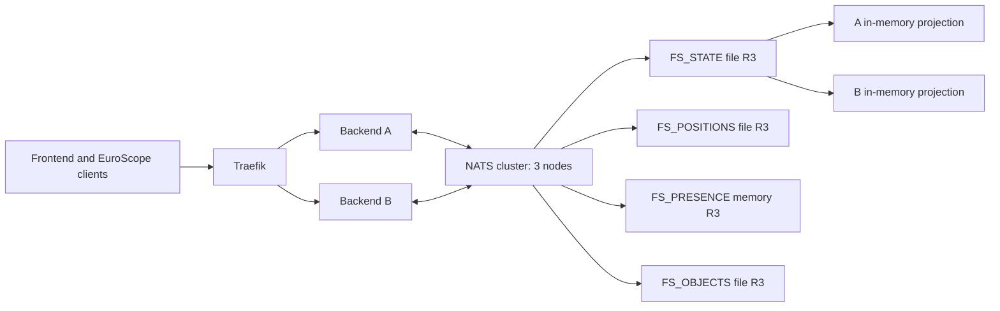

# Multi-node NATS-only backend

This directory is the implementation handoff for replacing FlightStrips' single-node PostgreSQL backend with replicated backend memory and NATS-only operational persistence. The operator decisions recorded here take precedence over the older multi-server paragraph in `backend/Architecture.md` and over PostgreSQL-specific performance descriptions. Domain behavior in `.github/specs/aman-cph.md` and existing tests still applies unless this specification explicitly changes its storage or delivery mechanism.

## Fixed outcome

- Run at least two backend replicas behind the existing Traefik route and three NATS storage nodes on distinct Swarm hosts. Every backend holds a complete in-memory projection of active session state and can serve any frontend or EuroScope connection.
- Use file-backed, three-replica JetStream for all durable operational state. Use NATS memory storage only for disposable connection presence. Do not add Redis or retain PostgreSQL in the new runtime.
- Start the new deployment empty. There is **no data migration**, dual write, old-protocol adapter, or support for old frontend/plugin versions. Release the new backend, frontend, and required EuroScope plugin protocol together.
- Preserve state after a complete backend and NATS shutdown. A backend failure should require only WebSocket reconnection and an ownership handoff, with no loss of acknowledged state.
- A frontend command that invokes EuroScope must have a durable, replayable result. `executed` means the plugin's local API/UI action completed; a private-message result never claims pilot receipt. A claimed dispatch with uncertain execution ends `unknown` and is not automatically retried.
- New multi-node NATS, Object Store, frontend WebSocket and EuroScope WebSocket payloads are binary Protobuf with typed fields. No JSON-in-Protobuf or opaque serialized domain payload is allowed. First-party HTTP APIs retain JSON bodies. **ALB is outside this project and its code, endpoint and protocol must not be changed.**

## Architecture

One owner serializes commands for each global, airport, or session aggregate. Ownership claims and mutations are appended to the same per-aggregate JetStream subject. All backend replicas independently replay the committed stream and watch the position/presence buckets; local WebSocket hubs deliver the resulting deltas to clients connected to that replica. Large immutable navigation artifacts and projection snapshots live in NATS Object Store. Core NATS request/reply routes commands to an owner but never establishes durability. JetStream `PubAck` plus local projection application establishes a successful write.

The architecture intentionally separates **durable state** (JetStream) from **warm copies** (backend memory) and **current sockets** (presence). Live presence is reconstructed after a total shutdown; old socket records cannot imply a live controller.

## Source-of-truth contracts

1. [contracts.md](contracts.md) fixes subjects, write/replay semantics, ownership fencing, client messages, and command results.
2. [storage-contract.md](storage-contract.md) fixes exact message-to-resource mapping, keys, object digests, validation, and schema evolution. The three [Protobuf schemas](proto/) fix field numbers and oneofs now.
3. [coverage.md](coverage.md) maps the existing browser actions, publications, and durable families to typed messages; first-party HTTP remains JSON at its boundary.
4. [state-map.md](state-map.md) assigns every present persistence family and process-local shared value to an aggregate, object, or presence record.
5. [operations.md](operations.md) fixes Swarm topology, readiness, backup, failure handling, and release gates.
6. [release-safety.md](release-safety.md) fixes which tasks may merge and ship independently, which changes stay on the integration branch, and the coordinated cutover order.

An implementation that cannot satisfy a contract must update these documents and all affected task acceptance checks in one reviewed change before changing behavior. Do not let separate tasks independently invent wire fields, retention, lease times, or fallback behavior.

## Ordered task files

| ID | Task | Depends on | Status |
| --- | --- | --- | --- |
| 00 | [Protobuf contract tooling and coverage](tasks/00-protobuf-contract-tooling.md) | None | Merged ([#795](https://github.com/flightstrips/FlightStrips/pull/795)) |
| 01 | [NATS resources and local fixture](tasks/01-nats-resources.md) | 00 | Merged ([#796](https://github.com/flightstrips/FlightStrips/pull/796)) |
| 02 | [Aggregate event and conditional write](tasks/02-event-write.md) | 01 | Merged ([#797](https://github.com/flightstrips/FlightStrips/pull/797)) |
| 03 | [Replay, projections and snapshots](tasks/03-projections.md) | 02 | Merged ([#798](https://github.com/flightstrips/FlightStrips/pull/798)) |
| 04 | [Global session registry](tasks/04-session-registry.md) | 03 | Merged ([#799](https://github.com/flightstrips/FlightStrips/pull/799)) |
| 05 | [Controller, sector and runway state](tasks/05-controller-sector.md) | 04 | Merged ([#801](https://github.com/flightstrips/FlightStrips/pull/801)) |
| 06 | [Strip state and edit invariants](tasks/06-strips.md) | 04, 05 | Merged ([#803](https://github.com/flightstrips/FlightStrips/pull/803)) |
| 07 | [Coordination and transfers](tasks/07-coordination.md) | 05, 06 | Merged ([#807](https://github.com/flightstrips/FlightStrips/pull/807)) |
| 08 | [Stand allocation and blocks](tasks/08-stands.md) | 06 | Merged ([#806](https://github.com/flightstrips/FlightStrips/pull/806)) |
| 09 | [PDC and tactical strips](tasks/09-pdc-tactical.md) | 04, 06 | Merged ([#808](https://github.com/flightstrips/FlightStrips/pull/808)) |
| 10 | [Positions and shared session state](tasks/10-session-observations.md) | 03, 05, 06 | Merged ([#809](https://github.com/flightstrips/FlightStrips/pull/809)) |
| 11 | [AMAN operational state](tasks/11-aman.md) | 03, 04 | Merged ([#802](https://github.com/flightstrips/FlightStrips/pull/802)) |
| 12 | [Navigation and weather](tasks/12-navigation-weather.md) | 03, 11 | Merged ([#804](https://github.com/flightstrips/FlightStrips/pull/804)) |
| 13 | [Owner leases and routing](tasks/13-owner-routing.md) | 02, 03 | Merged ([#800](https://github.com/flightstrips/FlightStrips/pull/800)) |
| 14 | [EuroScope plugin protocol](tasks/14-plugin-protocol.md) | 02 | Merged to integration base ([#805](https://github.com/flightstrips/FlightStrips/pull/805)); held from `main`/release |
| 15 | [Binary frontend transport](tasks/15-frontend-commands.md) | 06, 13 | Merged to integration base ([#810](https://github.com/flightstrips/FlightStrips/pull/810)); held from `main`/release |
| 15a | [Browser command outcomes](tasks/15a-browser-results.md) | 13, 15 | Merged to integration base ([#811](https://github.com/flightstrips/FlightStrips/pull/811)); held from `main`/release |
| 15b | [HTTP JSON boundary and outcomes](tasks/15b-http-results.md) | 02, 13 | Merged to integration base ([#813](https://github.com/flightstrips/FlightStrips/pull/813)); held from `main`/release |
| 16 | [Master election and fanout](tasks/16-master-fanout.md) | 05, 10, 13, 14 | Merged to integration base ([#812](https://github.com/flightstrips/FlightStrips/pull/812)); held from `main`/release |
| 17 | [Durable plugin effects](tasks/17-effects.md) | 09, 13–16, 15a | Merged to integration base ([#814](https://github.com/flightstrips/FlightStrips/pull/814)); held from `main`/release |
| 18 | [Session workers and cleanup](tasks/18-session-workers.md) | 04–10, 13, 14, 17 | Not started |
| 19 | [Airport and global workers](tasks/19-airport-workers.md) | 11–13, 17 | Not started |
| 20 | [Application runtime cutover](tasks/20-app-cutover.md) | 04–19, 15a, 15b | Not started |
| 21 | [Production Swarm infrastructure](tasks/21-infrastructure.md) | 01, 03, 13, 20 | Not started |
| 22 | [Cross-node fault and recovery suite](tasks/22-fault-integration.md) | 17–21 | Not started |
| 23 | [Position load and capacity gate](tasks/23-performance.md) | 22 | Not started |
| 24 | [Fresh NATS-only production cutover](tasks/24-fresh-release.md) | 20–23 | Not started |

Each task is scoped for one reviewable implementation change, though a task may need more than one PR when generated code or the private infrastructure repository is involved. **Reviewable does not mean independently releasable.** Apply the per-task [merge and release matrix](release-safety.md#per-task-decision) before merging any implementation task. Tasks can proceed in parallel when their listed prerequisites are complete. Update the status table and attach links to PRs and test evidence as tasks finish. Task 24 is the coordinated production cutover; tasks 22 and 23 are its fault and capacity gates.

## Non-negotiable invariants

1. No acknowledged mutation exists solely in process memory, Core NATS, or an unacknowledged publish.
2. No backend runs a side effect unless its dispatch claim was committed under an accepted owner epoch. A stale owner/master cannot create an effective mutation.
3. An aggregate event is the atomic unit. Cross-aggregate work is an explicit durable workflow with visible pending/failure state.
4. Every backend can rebuild the same projection from the same snapshots and events. Full event history is retained in this version; no automatic `FS_STATE` eviction or compaction.
5. Position observations are latest-value state and may be marked stale after reconnect; accepted strip, stand, AMAN, PDC, and command outcomes are durable domain state.
6. A target EuroScope CID is never changed silently. An effect that might have executed is never automatically sent again.
7. No PostgreSQL, Redis, frontend/EuroScope compatibility client, or JSON-in-Protobuf escape hatch is shipped in the new runtime. ALB remains unchanged.

## References

- Current service construction and worker startup: `backend/internal/app/app.go`.
- Current frontend and EuroScope socket hubs: `backend/internal/frontend/hub.go` and `backend/internal/euroscope/hub.go`.
- Current EuroScope wire schema: `proto/euroscope.proto`.
- Current production stack: [flightstrips/infrastructure/stacks/flightstrips.yml](https://github.com/flightstrips/infrastructure/blob/main/stacks/flightstrips.yml).
- NATS behavior: [JetStream](https://docs.nats.io/concepts/jetstream), [advanced publishing and subject CAS](https://docs.nats.io/learn/jetstream/advanced-publishing), [KV](https://docs.nats.io/learn/key-value/), and [Object Store](https://docs.nats.io/learn/object-store/).
