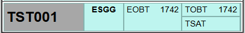
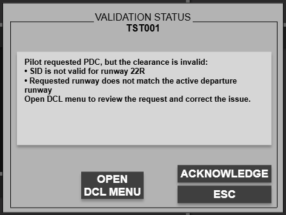
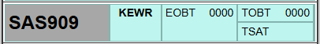
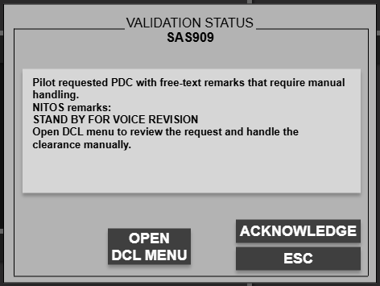
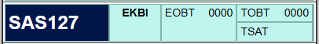

Valid PDC requests are handled automatically. This page only documents the PDC states that need controller awareness or manual action.

---

## PDC invalid

**The pilot requested PDC, but the clearance data is not valid.**

For an invalid PDC request, the strip raises a **validation**:

- the **callsign cell blinks grey**
- clicking the callsign opens **Validation Status**
- the dialog offers **OPEN DCL MENU**

Use this when the request has a wrong runway, wrong SID, or another backend PDC fault. Correct the data in the DCL window, then issue the clearance or revert to voice.

---

## Custom / manual PDC

**The request contains free-text remarks and needs manual handling.**

The strip keeps the normal strip background, but it also raises a validation so you know the request cannot be processed automatically.

This is typically used when the pilot sends **NITOS remarks** or other manual-handling text. Open the DCL menu, review the remarks, and handle the request manually.

---

## Cleared via PDC

After **CLD**, the strip moves to **CLEARED**. The strip body returns to the normal cleared-strip background, while the **callsign cell stays navy** to show the departure clearance was sent by PDC.

Once the pilot acknowledges the clearance, the strip returns to normal colouring.

---

## Web PDC

Pilots without simulator datalink can use the **`/pdc`** page instead. Controller handling is the same: review the strip, clear it from DCL, and wait for pilot acknowledgement on the web side.

For the shared locking and acknowledgement rules used by all validations, see [Validation status](/procedures/validation-status/).
