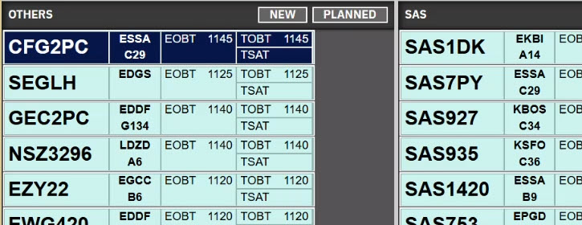
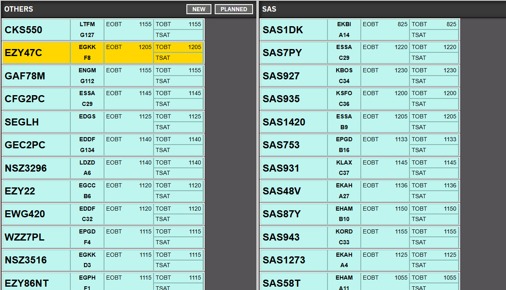
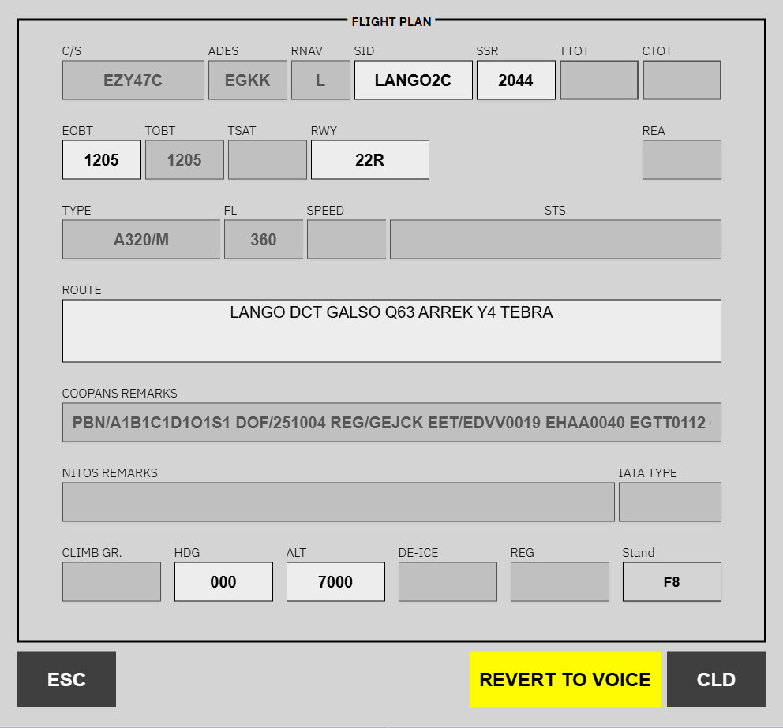
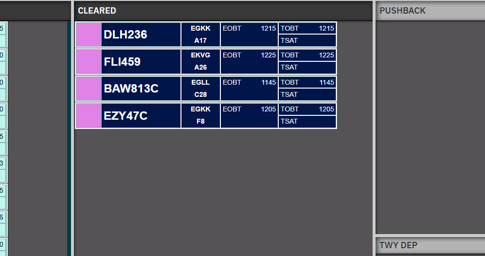

When a pilot requests a **pre-departure clearance** through datalink, the strip colour tells you what to do next.

---

## PDC requested

**Review the plan and issue if it is valid.**

The pilot has sent a PDC request. The strip shows the **PDC requested** styling (navy highlight). No need for interaction as this point.

---

## PDC Faults

**The automatic PDC workflow has failed.**

Something in the request or flight plan does not match what can be cleared automatically. The strip uses the **faults** (yellow) styling so it stands out.

Adjust what you can in the flight plan, coordinate with the pilot on frequency if needed, or use **REVERT TO VOICE** when datalink clearance is not appropriate.

---

## Cleared via PDC

After you issue the clearance through the PDC flow, the strip shows the **PDC cleared** (navy) styling. Continue with normal monitoring, frequency discipline, and handoffs.

---

## Web PDC

Pilots without simulator datalink can file the same request on your site’s **`/pdc`** page . You still clear them from the strip; they read the text on the web and confirm receipt there.