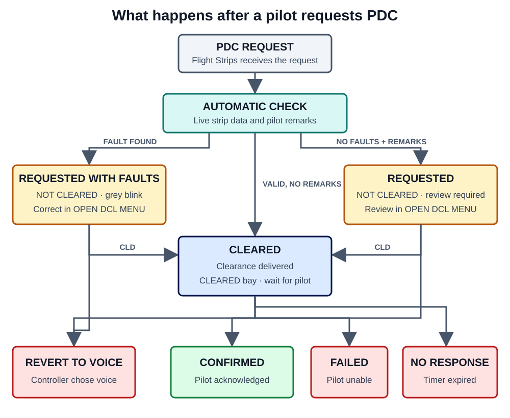
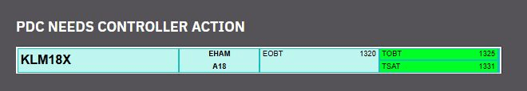
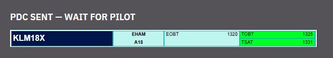
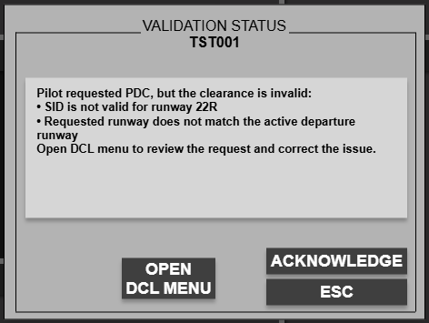
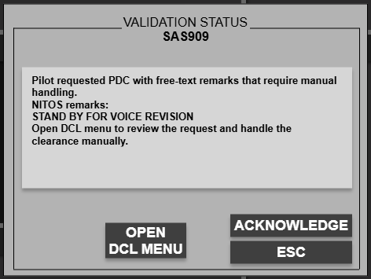

Flight Strips issues a valid pre-departure clearance (PDC) automatically when the pilot has not added remarks. The controller steps in only when the clearance needs review, cannot be issued automatically, or must continue by voice.

## The complete PDC flow

The most important distinction is:

- **REQUESTED** or **REQUESTED WITH FAULTS:** Flight Strips has not issued the clearance. Review it.
- **CLEARED:** Flight Strips has delivered the clearance and is waiting for the pilot. Do not send it again.
- **CONFIRMED:** The pilot acknowledged the clearance. No PDC action is required.
- **FAILED**, **NO RESPONSE**, or **REVERT TO VOICE:** The strip is no longer cleared. Continue by voice or arrange another request.

## What you see on the strip

### Grey blinking callsign: controller action required

An active PDC validation alternates the callsign between grey and its normal background once per second.

Click the callsign to open **Validation Status**, then use **OPEN DCL MENU**. The strip remains in **NOT CLEARED**, and the validation blocks normal moves, handoffs, and most field changes until it is handled or acknowledged.

### Navy blinking callsign: clearance sent, wait

When the PDC state changes to **CLEARED**, the callsign alternates between navy and its normal background every half-second for seven seconds. It then remains navy until the pilot responds.

Flight Strips has already delivered the clearance and moved the strip to **CLEARED**. Do not issue a duplicate clearance.

### Normal callsign in CLEARED: pilot confirmed

When the pilot acknowledges the PDC, the state becomes **CONFIRMED** and the navy callsign is removed. The strip stays in **CLEARED**. Flight Strips cancels the response timer and, when required, attempts to assign the configured owner for cleared departures.

## The three request paths

### Valid request without remarks

Flight Strips checks the current strip and automatically:

1. Builds the clearance from the assigned runway, SID or complete vectored departure, squawk, and calculated frequencies.
2. Delivers it through the channel used for the request.
3. Changes the PDC state to **CLEARED** and moves the strip to **CLEARED**.
4. Starts waiting for the pilot's response.

The controller does not need to open the flight plan or press **CLD**.

### Request with validation faults

The state becomes **REQUESTED WITH FAULTS**, and Flight Strips creates a **PDC INVALID** validation. Implemented checks include:

- no SID and no complete vectored departure;
- a SID that is unavailable for PDC or incompatible with the aircraft's engine type;
- an assigned runway that is not an active departure runway;
- a configured aircraft/runway restriction; and
- an ECFMP mandatory route that requires controller review.

Click the blinking callsign, choose **OPEN DCL MENU**, and correct the displayed problem. You can then issue the PDC with **CLD** or choose **REVERT TO VOICE**.

### Request with free-text remarks

A request containing remarks is not issued automatically. When the clearance data is otherwise valid, the state becomes **REQUESTED**, and Flight Strips creates a **CUSTOM PDC** validation containing the pilot's text. If the request also has a flight-plan fault, it follows the **REQUESTED WITH FAULTS** path instead.

Open the DCL menu and review the remarks. Use **CLD** to issue the PDC when the request can be accepted, or **REVERT TO VOICE** when verbal coordination is needed.

A request can also remain **REQUESTED** without remarks when automatic issuance could not be completed. In that case, review and issue it manually.

## After the clearance is sent

| Pilot outcome | New state | What Flight Strips does | Controller action |
| --- | --- | --- | --- |
| Acknowledges | **CONFIRMED** | Confirms the cleared strip and cancels the response timer | None |
| Responds unable | **FAILED** | Removes the strip's cleared state | Continue by voice |
| Does not respond before the timer expires | **NO RESPONSE** | Removes the strip's cleared state | Continue by voice or arrange another request |

Using **REVERT TO VOICE** also cancels the response timer, changes the state to **REVERT TO VOICE**, and removes the strip's cleared state. After a voice clearance is recorded, Flight Strips clears the previous PDC state.

## State reference

| State | Bay | Visible cue | What you should do |
| --- | --- | --- | --- |
| **REQUESTED** | NOT CLEARED | Grey blink when a CUSTOM PDC validation is active | Review in the DCL menu |
| **REQUESTED WITH FAULTS** | NOT CLEARED | Grey blinking callsign | Correct the validation, then issue or revert to voice |
| **CLEARED** | CLEARED | Navy blinking callsign, then steady navy | Wait for the pilot |
| **CONFIRMED** | CLEARED | No PDC-specific callsign colour | No PDC action |
| **FAILED** | NOT CLEARED | No PDC-specific callsign colour | Continue by voice |
| **NO RESPONSE** | NOT CLEARED | No PDC-specific callsign colour | Continue by voice or arrange another request |
| **REVERT TO VOICE** | NOT CLEARED | No PDC-specific callsign colour | Issue and coordinate by voice |

## Web and datalink requests

Web PDC and datalink PDC use the same validation and automatic-issue decision. A valid request without remarks is not waiting for a controller to press **CLD**. The difference is only where the pilot receives and acknowledges the clearance.

For the locking, acknowledgement, and ownership rules shared by all validations, see [Validation status](/concepts/validation-status/).
