A strip does not keep one fixed shape. Flight Strips chooses a presentation that fits the flight's bay and the controller layout. The underlying flight remains the same; the displayed boxes change so the information needed for the current stage is visible.

## Box names

Not every strip type contains every box. These are the names used throughout the documentation:

| Box | What it displays |
| --- | --- |
| **SI** | Your position's ownership relationship to the strip and any pending handoff. See [Ownership and handoffs](/concepts/ownership/). |
| **Callsign** | The aircraft callsign. On operational strips, the next frequency or position can appear beneath it prefixed by `:`. |
| **A/C type** | Aircraft type and, where shown, wake-turbulence category. |
| **Registration** | Aircraft registration, shown below the aircraft type on apron strips. |
| **Destination** | Destination aerodrome. |
| **Stand** | Assigned or expected parking stand. |
| **Squawk** | Assigned transponder code. |
| **Runway** | Assigned arrival or departure runway. |
| **TWY** | Taxiway or taxi clearance limit. |
| **HP** | Holding point. |
| **SID** | Standard instrument departure. |
| **Cleared FL** | Cleared altitude or flight level. |
| **Heading** | Assigned heading. |
| **EOBT** | Estimated off-block time. |
| **TOBT** | Target off-block time. |
| **TSAT** | Target start-up approval time. |
| **CTOT** | Calculated take-off time. The box is blank when the flight has no CTOT to display. |
| **QNH** | Current pressure setting decoded from the airport METAR. |
| **POB** | Persons on board. |
| **Status** | `GROUND` or `AIRBORNE` on a control-zone strip. |
| **Language** | Pilot language recorded on a control-zone flight plan. |
| **FPL type** | Flight-plan type recorded for a control-zone flight. |

Some boxes are intentionally blank. Where described below, a blank box is still clickable and opens the flight plan.

## Departure strip types

### Before clearance

The pre-clearance strip is used for flights that have not moved to **CLEARED**. It has no SI box because it is a clearance-delivery work item rather than an owned operational strip.

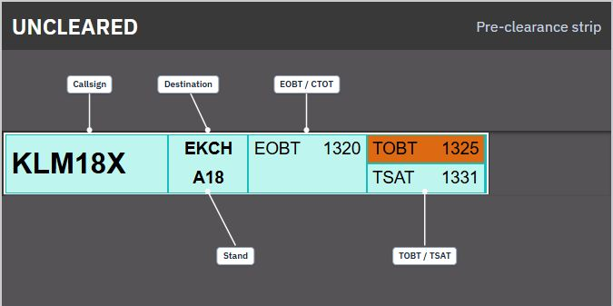

Left to right:

| Callsign | Destination / Stand | EOBT / CTOT | TOBT / TSAT |
| --- | --- | --- | --- |

The destination and stand share one box. EOBT and CTOT share another; TOBT and TSAT share the last.

### Cleared summary

The cleared summary shown on the clearance layout adds ownership while retaining the time-focused clearance view.

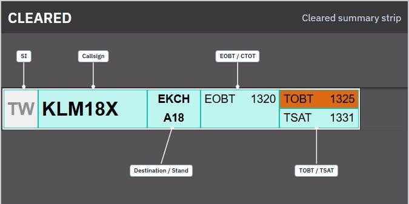

Left to right:

| SI | Callsign | Destination / Stand | EOBT / CTOT | TOBT / TSAT |
| --- | --- | --- | --- | --- |

### Compact clearance strip

When another layout shows clearance traffic in a narrow bay, Flight Strips uses this compact form:

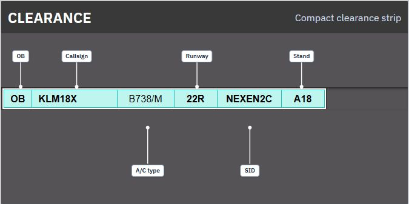

| OB | Callsign | A/C type | Runway | SID | Stand |
| --- | --- | --- | --- | --- | --- |

`OB` is the identifier displayed in the first box of this strip type. It is not the ownership SI box.

### Start-up, pushback and de-ice

The same presentation is used in the implemented **STARTUP**, **PUSHBACK** and **DE-ICE** bays.

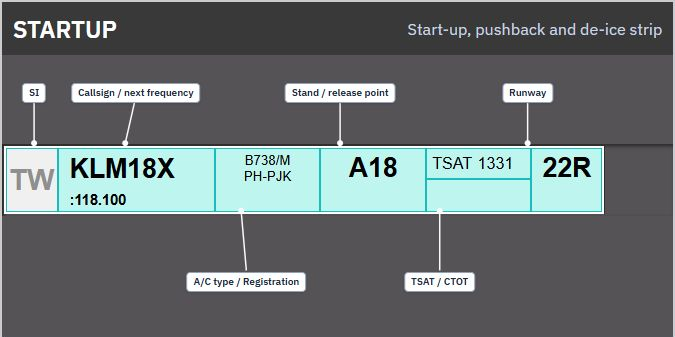

| SI | Callsign / next frequency | A/C type / Registration | Stand or release point | TSAT / CTOT | Runway |
| --- | --- | --- | --- | --- | --- |

The stand box displays the release point instead of the stand once a release point exists.

### Apron departure taxi

Apron controller layouts use this departure-taxi presentation:

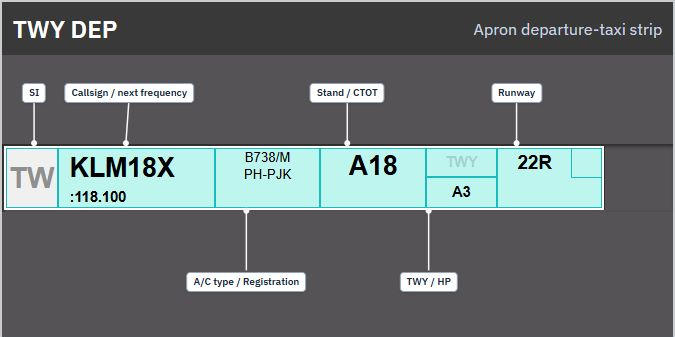

| SI | Callsign / next frequency | A/C type / Registration | Stand / CTOT | TWY / HP | Runway |
| --- | --- | --- | --- | --- | --- |

The TWY/HP box changes its emphasis depending on whether the stored release point is a taxiway or holding point.

### Tower and ground departure taxi

Tower and ground layouts use the more detailed departure strip for departure traffic in **TWY-DEP**, **RWY-DEP** and **AIRBORNE**:

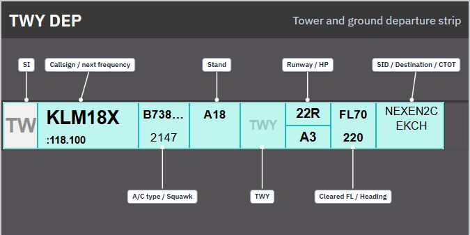

| SI | Callsign / next frequency | A/C type / Squawk | Stand | TWY | Runway / HP | Cleared FL / Heading | SID / Destination / CTOT |
| --- | --- | --- | --- | --- | --- | --- | --- | --- |

The last box stacks SID, destination and CTOT. A red cleared-flight-level box indicates that the requested altitude violates an active ECFMP prohibited-level restriction. A red destination section indicates an active ECFMP ground-stop restriction.

## Arrival strip types

### Final, runway and taxi arrival

The tower and ground layouts use one arrival presentation in **FINAL**, **RWY-ARR** and **TWY-ARR**:

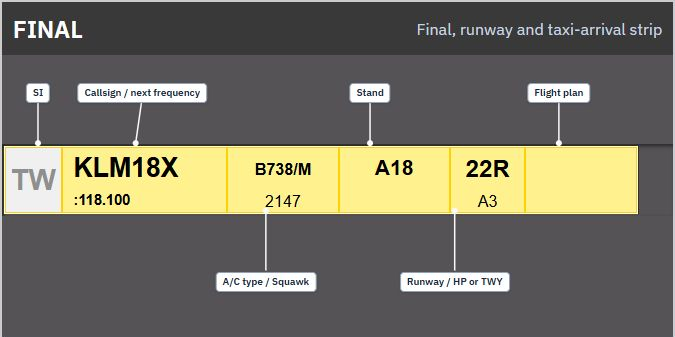

| SI | Callsign / next frequency | A/C type / Squawk | Stand | Runway / HP or TWY | Flight plan |
| --- | --- | --- | --- | --- | --- |

The final flight-plan box is intentionally blank. Click it to open the flight plan. The runway box controls runway-clearance or confirmation actions only while the strip is in FINAL or RWY-ARR and owned by your position.

### Apron arrival

Apron layouts use a registration-focused arrival strip:

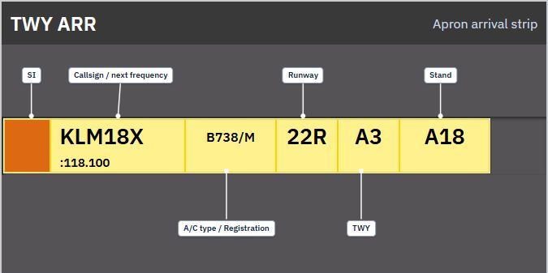

| SI | Callsign / next frequency | A/C type / Registration | Runway | TWY | Stand |
| --- | --- | --- | --- | --- | --- |

### Compact arrival and pushback strips

Compact strips are used where a full strip is not required. The left identifier distinguishes their purpose:

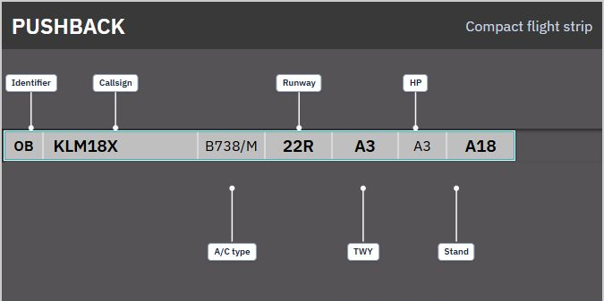

| Identifier | Callsign | A/C type | Runway | TWY | HP | Stand |
| --- | --- | --- | --- | --- | --- | --- |

The implemented controller layouts currently show `OB` for compact pushback traffic and `LA` for locked arrival traffic. A locked arrival strip is read-only.

## Control-zone strip

The control-zone strip is a separate VFR-oriented presentation:

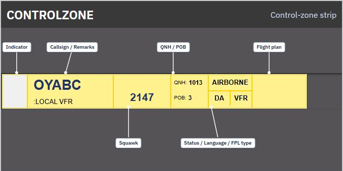

| Indicator | Callsign / Remarks | Squawk | QNH / POB | Status / Language / FPL type | Flight plan |
| --- | --- | --- | --- | --- | --- |

The first box is a fixed white indicator in the current implementation, not the normal ownership SI. The last box is intentionally blank and opens the flight plan.

At EKCH, the displayed status changes from `GROUND` to `AIRBORNE` when the reported altitude is more than 200 feet above the configured field elevation of 17 feet. If the altitude is unavailable—or the airport is not EKCH—the displayed status is `GROUND`.

## Non-flight strips

### Tactical strips

Flight Strips also renders tactical items that are not flight plans:

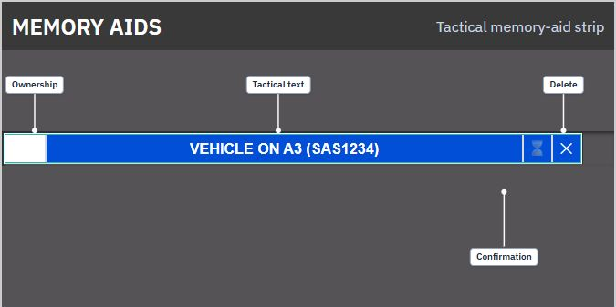

- **Memory aid:** blue, with its label and optional aircraft reference. It includes a confirmation cell when another controller needs to acknowledge it.
- **Crossing:** yellow, with its label and optional aircraft reference.
- **START** and **LAND:** orange runway-action reminders with their type, label and optional aircraft reference.

When you own a tactical strip, it has a white ownership cell on the left and a delete box on the right. Clicking the body marks or unmarks it. A controller who does not own it can open its ownership menu and use **FORCE ASSUME**.

### Message strips

A message strip contains three boxes:

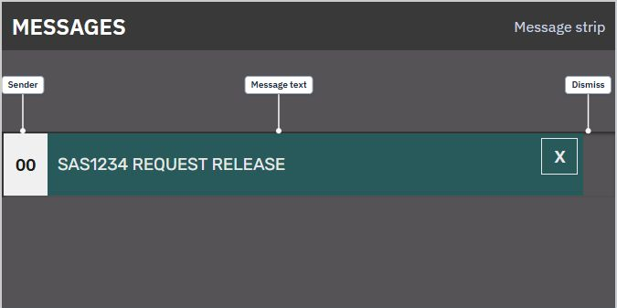

| Sender indicator | Message text | Dismiss |
| --- | --- | --- |

The sender indicator represents a system, broadcast or personal message. The **X** box dismisses the message from the board.
