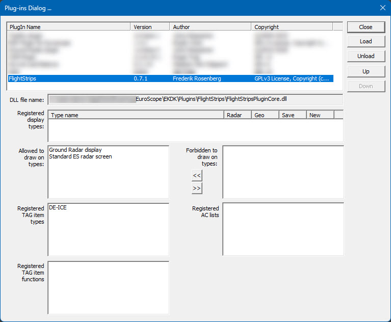

Use this guide to install the latest FlightStrips development build for alpha testing.
If anything is unclear, ask in `#alpha-testers`.

## Download the latest build

Download the latest `FlightStripsCore.dll` and `flightstrips_config.ini` from the [FlightStrips releases](https://github.com/flightstrips/FlightStrips/releases), under the `FlightStripsPlugin` release tag.

## Place the files in your EuroScope plugin folder

- Copy both files to `%appdata%/EuroScope/EKDK/Plugins/FlightStrips`.
- If you already use FlightStrips in production, create a separate folder such as `FlightStrips-Test` and place the alpha files there.

## Load the plugin in EuroScope

- Start EuroScope.
- Load the `FlightStripsCore` plugin.
- Confirm the plugin is allowed to draw on screen.

