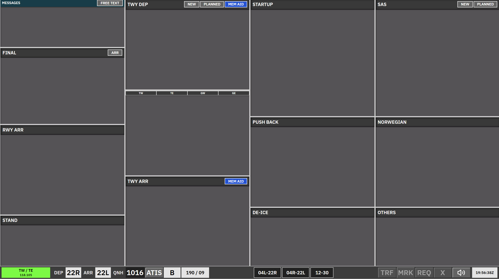

# Kastrup Apron Arrival + Departure

**AA + AD** is the **combined** ground scope: **Apron Arrival** and **Apron Departure** in one view. Use it when a single `_GND` position works both sides.

Strips are organised into **bays**. A bay is usually **ACTIVE** or **LOCKED**. Strips that are not yours can only be acted on with **REQ**, except fully **LOCKED** strip types which cannot be requested.

---

## Bay overview

| Bay (as shown) | Strip type | Notes |
| --- | --- | --- |
| **Messages** | Messages | Free-text / coordination strip column. |
| **Final** | Arrival locked | **Locked** bay |
| **RWY ARR** | `TWY-ARR` | Arrival on the runway segment. **Can be REQ** if not yours. |
| **STAND** | `APN-ARR` | Arrivals at gate/stand. **Can be REQ** if not yours. |
| **TWY ARR** | `APN-ARR` | Taxiing arrival after the runway; **ACTIVE**. Transfer from GW by SI; assume ownership when appropriate. Move to **STAND** when parked at the gate. |
| **TWY DEP** | `APN-TAXI-DEP` | **TWY DEP-UPR** and **TWY DEP-LWR** share the same strip logic; **LWR** is the lower part of the column (often without its own header). **UPR**: SI to ground west / splits; **LWR**: aircraft cleared to the last hold-short before handoff are usually placed here so tower sees the right picture. |
| **Startup** | `APN-PUSH` | Where strips go **after clearance** when the **OTHERS / SAS / NORWEGIAN** uncleared bays are active: issuing clearance via the ATC clearance dialogue moves the strip here (**STARTUP**). **Can be REQ** in some cases. |
| **Push back** | `APN-PUSH` | **ACTIVE**. After choosing a release point on the pushback map, the strip moves here from **Startup**; stand shows release point; opens apron taxi map from here. |
| **De-ice** | `APN-TAXI-DEP` | Same strip family as **TWY DEP**; routing via hold-short moves traffic between **De-ice**, **TWY DEP-UPR**, and **TWY DEP-LWR** per map logic. |
| **SAS** | Uncleared | **ACTIVE** when delivery is *not* covering these flows; **locked** if **CLR DEL**, **DEL+SEQ**, or **SEQ PLN** is online. |
| **Norwegian** | Uncleared | Same as **SAS**. |
| **Others** | Uncleared | Same uncleared behaviour as [CLR DEL](/ekch/clr-del/) **OTHERS / SAS / Norwegian**; sorted from the **top** of the scope downward (unlike some other bays). |

Exact labels in the UI may shorten names (for example **TWY ARR Startup** for the **Startup** bay). The internal names **TWY DEP-UPR** / **TWY DEP-LWR** describe the two parts of the **TWY DEP** column.

---

## Arrival side

- **Final** and **RWY ARR** (runway arrival segment): **Final** is locked; **RWY ARR** uses the `TWY-ARR` strip and may be REQ’d.  
- **TWY ARR** (apron) and **STAND**: apron arrival strips — taxi on **TWY ARR**, park on **STAND**; **STAND** strips time out after a short period at the gate unless moved again.  
- Details for **Final** / **RWY ARR** strip sourcing are defined together with tower chapters.

---

## Departure side

- **OTHERS**, **SAS**, **Norwegian**: uncleared departures awaiting clearance. When those bays are **active**, clearing in the ATC clearance dialogue sends the strip to **Startup**.  
- **Startup**: cleared departures ready for pushback startup flow; ownership depends who cleared them.  
- **Push back**: release point chosen → then taxi via **De-ice** / **TWY DEP-UPR** / **TWY DEP-LWR** using hold-short selections on the apron taxi map (routing rules decide upper vs lower **TWY DEP** and **De-ice**).

---

## REQ and transfers

- Bays marked **Can be REQ** allow requesting a strip you do not own when the bay rules allow it.  
- **APN-TAXI-DEP** strips in **TWY DEP** qualify for **SI** transfer to the next controller (e.g. GW) subject to system rules.  
- Manual moves are allowed between **ACTIVE** bays.

For clearance dialogue, PDC strip colours, and delivery workflow, see [CLR DEL](/ekch/clr-del/) and [Pre-departure clearance (PDC)](/concepts/pre-departure-clearance/).
