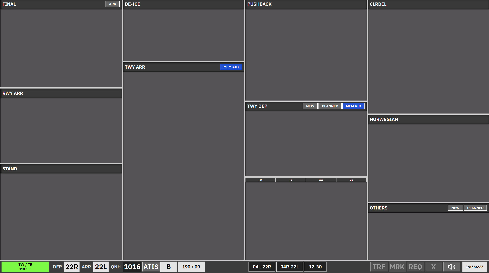

**Apron Arrival** is the scope used by **A_GND** when **B_GND** and/or **C_GND** is online: arrival apron is split from departure, but strip behaviour matches the combined [AA + AD](/ekch/aa-ad/) layout.

Strips sit in **bays** that are **ACTIVE** or **LOCKED**. Traffic you do not own is handled with **REQ** where the bay allows; fully locked strip types cannot be requested.

## Bay overview

| Bay | Strip type | Notes |
| --- | --- | --- |
| **Messages** | Messages | Coordination / free-text column. |
| **Final** | Arrival locked | Locked — not accessible in this scope. |
| **RWY ARR** | `TWY-ARR` | Runway arrival segment. Can be REQ. |
| **STAND** | `APN-ARR` | At gate/stand. Can be REQ. |
| **TWY DEP** (upper + lower) | `APN-TAXI-DEP` | Same TWY DEP-UPR / TWY DEP-LWR split as [AA + AD](/ekch/aa-ad/). |
| **TWY ARR** | `APN-ARR` | Apron arrival taxi; active. Move to STAND when parked. |
| **Startup** | `APNPUSH` | Cleared departures after clearance dialogue; can be REQ in some cases. |
| **Push back** | `APNPUSH` | Active — pushback / release flow. |
| **De-ice** | `APN-TAXI-DEP` | Same family as TWY DEP; routing via hold-short links De-ice and TWY DEP bays. |
| **SAS** | Uncleared | Locked if CLR DEL, DEL+SEQ, or SEQ PLN is online. |
| **Norwegian** | Uncleared | Same as SAS. |
| **Others** | Uncleared | Same rules as [CLR DEL](/ekch/clr-del/); sorted top-down. |

## Arrival side

- **Final** (locked here) and **RWY ARR**: RWY ARR strips may be REQ'd.
- **TWY ARR** and **STAND**: taxi on TWY ARR, park on STAND. STAND strips time out at the gate after a short period.

## Departure side

Others / SAS / Norwegian → clearance → Startup → Push back → De-ice / TWY DEP routing, as in [AA + AD](/ekch/aa-ad/).

## REQ and transfers

Same principles as [AA + AD](/ekch/aa-ad/): REQ where marked, SI from TWY DEP when rules allow, manual moves between ACTIVE bays.

For clearance and PDC, see [CLR DEL](/ekch/clr-del/) and [Pre-departure clearance](/concepts/pre-departure-clearance/).

## Related

- [AA + AD](/ekch/aa-ad/) — combined apron arrival + departure
- [Apron Departure](/ekch/apn-dep/) — B/C_GND when apron is split the other way
