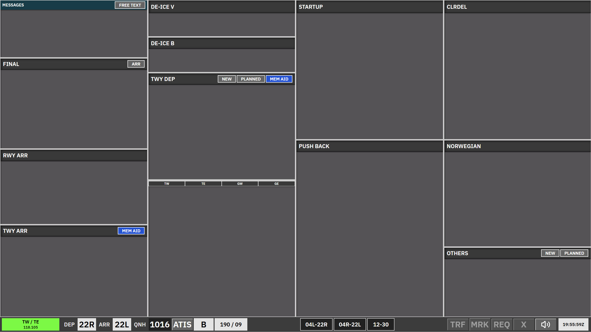

# Kastrup Apron Departure

**Apron Departure** is used when apron is split and **one** of these applies:

- **B\_GND** — **A\_GND** is online and **C\_GND** is offline, or  
- **C\_GND** — **B\_GND** and **A\_GND** are both online.

Strip behaviour matches [AA + AD](/ekch/aa-ad/) in general, but this scope has a **smaller set of bays** and different locking on some columns. Per the specification, **functions and features match AA + AD**, except **locked bays are not accessible** here.

**Note:** In this scope **RWY ARR** holds **ARR-LOCKED** strips in a **locked** bay (not the `TWY-ARR` REQ strip used in [AA + AD](/ekch/aa-ad/) / [Apron Arrival](/ekch/apn-arr/)). **Push back** is a **locked** bay here; there is **no** separate **TWY DEP** (UPR/LWR) or **Startup** column in the Apron Departure bay table.

---

## Bay overview

| Bay (as shown) | Strip type | Notes |
| --- | --- | --- |
| **Messages** | Messages | Coordination / free-text column. |
| **Final** | Arrival locked | **Locked** bay — not accessible in this scope. |
| **RWY ARR** | Arrival locked (`ARR-LOCKED`) | **Locked** bay — not the same as **RWY ARR** `TWY-ARR` in AA+AD/ARR. |
| **STAND** | `APN-ARR` | **ACTIVE**. |
| **TWY ARR** | `APN-ARR` | Apron arrival taxi; **ACTIVE**. |
| **De-ice** | `APN-TAXI-DEP` | **ACTIVE** — taxi / de-ice routing. |
| **Push back** | `APNPUSH` | **Locked** bay — not accessible in this scope. |
| **SAS** | Uncleared | **Locked** if **CLR DEL**, **DEL+SEQ**, or **SEQ PLN** is online. |
| **Norwegian** | Uncleared | Same as **SAS**. |
| **Others** | Uncleared | Same uncleared family as [CLR DEL](/ekch/clr-del/). |

There is no **Startup** and no **TWY DEP** upper/lower column in this scope’s table; departure flow still lines up with the same strip types elsewhere in the system when traffic is handed off or shown in other positions.

---

## Using this scope

- Treat **ACTIVE** bays as your normal work area; **LOCKED** columns are present for situational awareness but are **not** manipulated in Apron Departure the way they are in the combined [AA + AD](/ekch/aa-ad/) view.  
- **STAND**, **TWY ARR**, and **De-ice** cover apron arrival/de-ice taxi movements visible to this position.  
- For full pushback → taxi → **TWY DEP** sequencing with **Startup**, see [AA + AD](/ekch/aa-ad/) or [Apron Arrival](/ekch/apn-arr/) when those bays are in use on your sector split.

---

## REQ and transfers

Use **REQ** only where the bay and strip type allow. Locked bays do not offer the same REQ behaviour as active `TWY-ARR` / `APN-ARR` columns in other scopes.

For clearance dialogue and PDC, see [CLR DEL](/ekch/clr-del/) and [Pre-departure clearance (PDC)](/concepts/pre-departure-clearance/).

---

## Related

- [AA + AD](/ekch/aa-ad/) — full combined layout  
- [Apron Arrival](/ekch/apn-arr/) — A\_GND with B/C online
