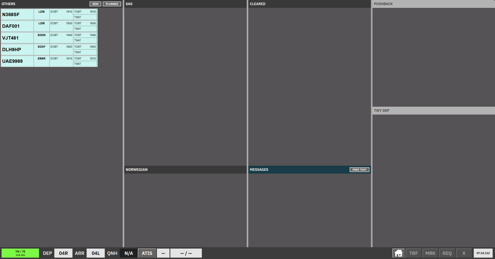
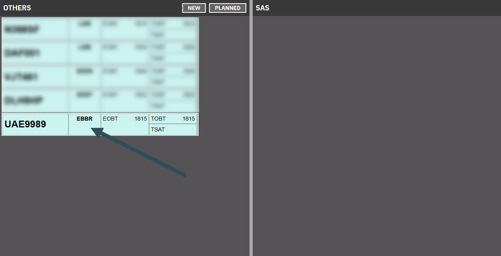
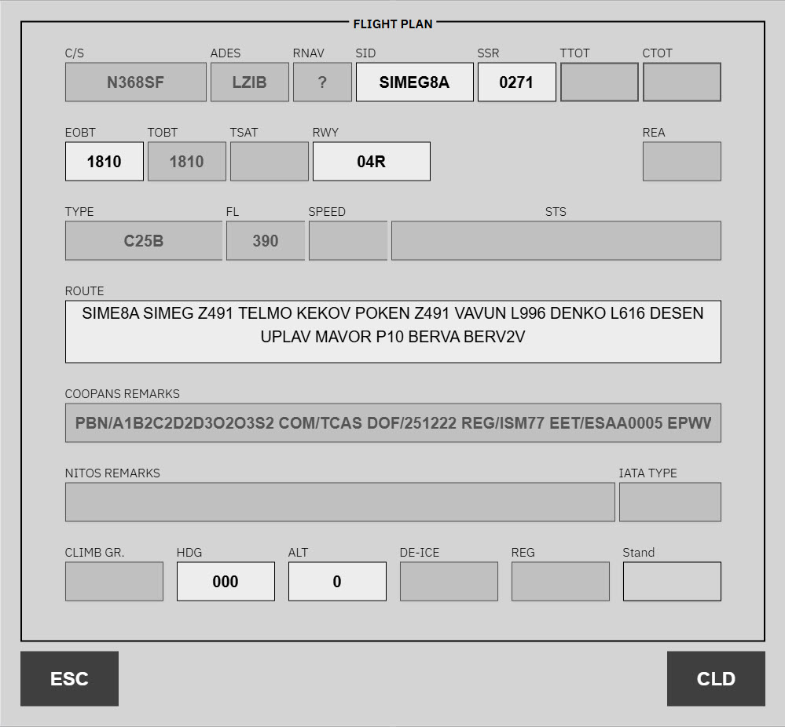
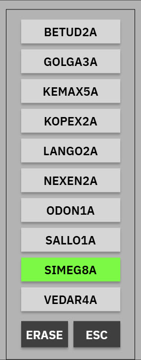
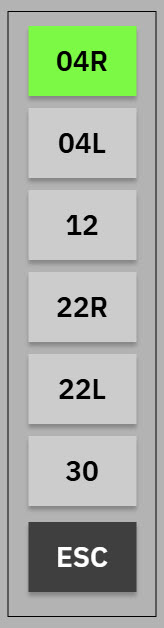
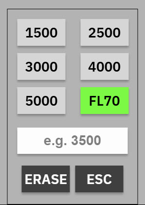
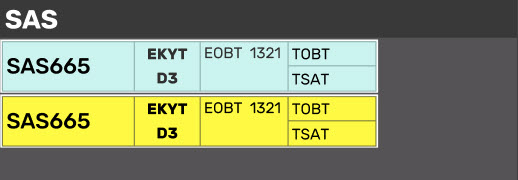
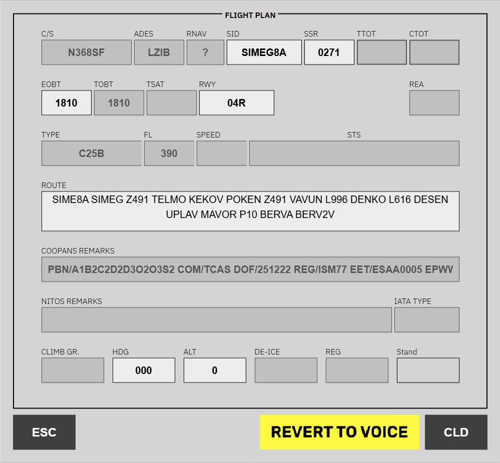

# Kastrup Clearance Delivery

**CLR DEL** (Clearance Delivery) is the scope for **EKCH\_DEL** only. It uses the **GND aspect** layout: **uncleared** departures in airline bays, then **CLEARED** once you issue a departure clearance from the ATC clearance window.

Strips sit in **bays** that are **ACTIVE** or **LOCKED**. You cannot drag uncleared strips to another bay by hand — after clearance, the system moves the strip to **CLEARED** (auto-local transfer via **CLD**).

---

## Bay overview

| Bay (as shown) | Strip type | Notes |
| --- | --- | --- |
| **Others** | Uncleared | Sorted from the **top** of the scope **downward** (opposite ordering to many other bays). |
| **SAS** | Uncleared | Airline grouping. |
| **Norwegian** | Uncleared | Airline grouping. |
| **Cleared** | Cleared | All strips after a departure clearance is issued here. |
| **Messages** | Messages | Coordination / free-text. |
| **Push back** | Departure locked (`DEP-LOCKED`) | **Locked** — visible for context, not manipulated like an active apron bay. |
| **TWY DEP** (upper) | Departure locked | **TWR DEP-UPR** — **Locked**. |
| **TWY DEP** (lower) | Departure locked | **TWY DEP-LWR** — **Locked**. |

---

## Uncleared strips

Used in **Others**, **SAS**, and **Norwegian**. Strips **cannot** be manually transferred to another bay or controller until cleared.

- **Callsign** — opens the callsign menu (e.g. **View FPL**).
- **Destination** / **Stand** — opens the **ATC clearance** dialogue (same action on **Stand** for a larger click area).

---

## Cleared strips

After **CLD** in the clearance window, the strip moves to the **Cleared** bay. The strip matches **uncleared** layout plus the **SI** (sector) box for ownership.

- Strips **cannot** be moved between bays by hand in the default **CLR DEL** configuration.
- **SI** transfer from **Cleared** is **disabled** for pure **CLR DEL**; it is **enabled** when **DEL+SEQ** is active (delivery also runs sequencing).

**Automatic handoff from Cleared** (default **CLR DEL** scope selected):

- **Two or fewer** apron ground positions online → **SI** hands off to **Apron Departure**.  
- **Three** apron ground positions online → **SI** hands off to **[Sequence planner (SEQ PLN)](/ekch/seq-pln/)**.

**DEL+SEQ** (delivery + sequencing on one position): strips can **stay** with **EKCH\_DEL** in **Cleared**; the **SI** indicator changes (e.g. white vs orange). Delivery then coordinates handoff to apron when startup time is reached. Manual **TRF** SI is still possible where the spec allows.

---

## Issue a clearance (workflow)

Use this when you need to issue or amend a departure clearance.

### Open the flight plan from the strip

In the strip view, click the **Destination / Stand** column for the aircraft.

This opens the flight plan editor for that aircraft.

### Review and update fields

The flight plan uses three field kinds:

- **Disabled** — read-only; pilots must refile to change.  
- **Dropdown** — valid options for this strip.  
- **Free-text** — e.g. **ROUTE**, where allowed.

Complete the clearance in the ATC clearance window and use **CLD** to close the dialogue and move the strip to **Cleared**.

---

## Pre-departure clearance (PDC / datalink)

When a pilot sends a **PDC/DCL** request, the strip shows **PDC requested** (purple) or **faults** (yellow) styling.

For strip states, **Web PDC**, faults, and coordination, see [Pre-departure clearance (PDC)](/concepts/pre-departure-clearance/).

**Faults (yellow):** open the flight plan and fix or coordinate; you may see **REVERT TO VOICE** when datalink clearance is not appropriate.

---

## Related

- [AA + AD](/ekch/aa-ad/) — combined apron after handoff  
- [Sequence planner (SEQ PLN)](/ekch/seq-pln/) — when three apron positions are online  
- [Apron Departure](/ekch/apn-dep/) — B/C\_GND split layout
