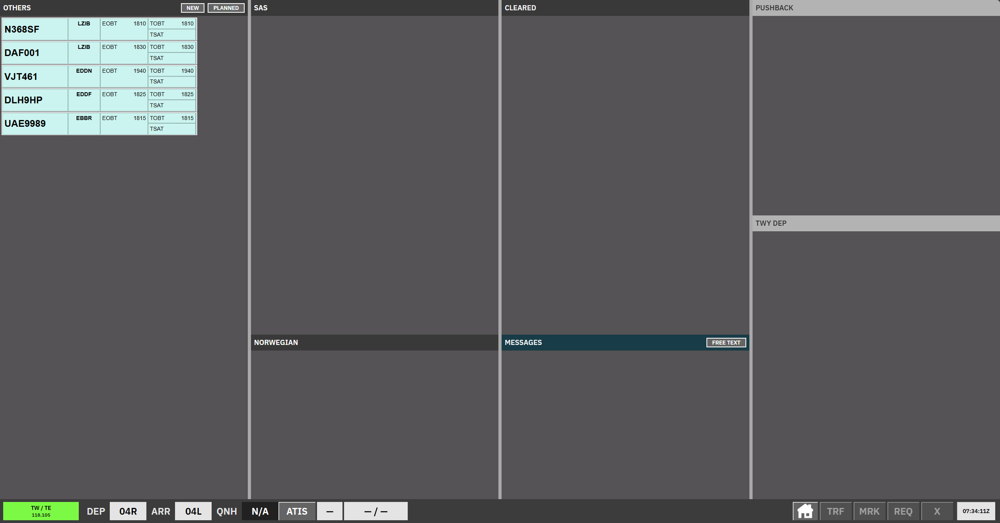
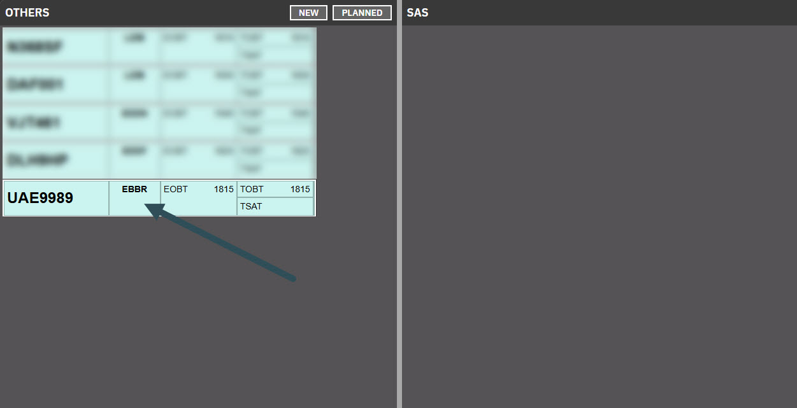
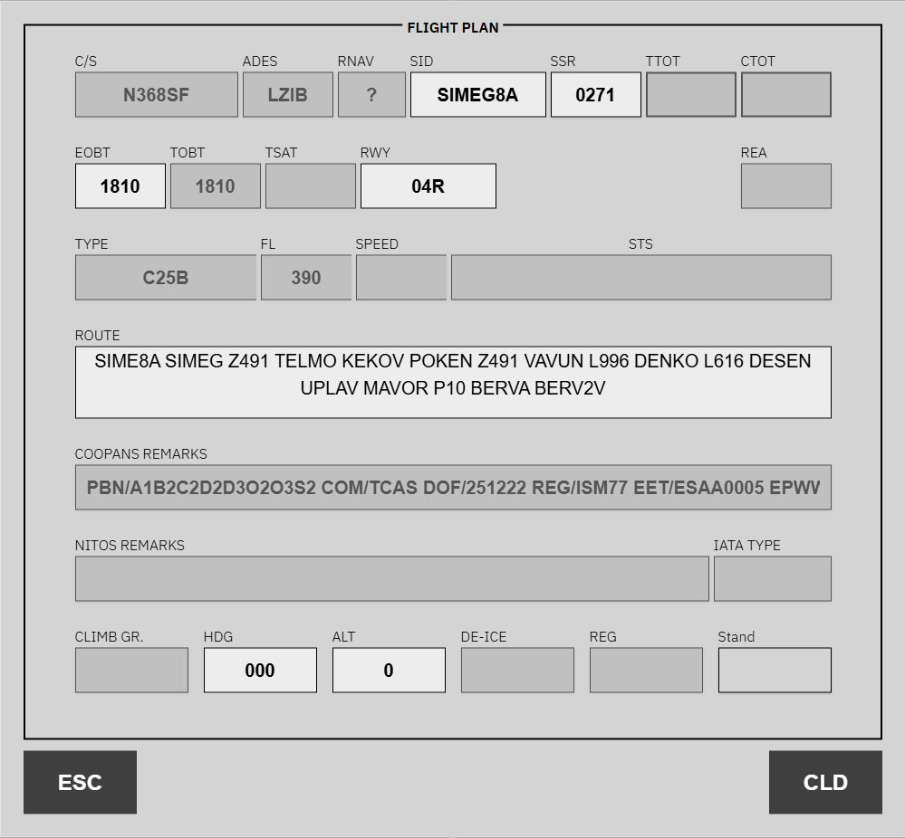
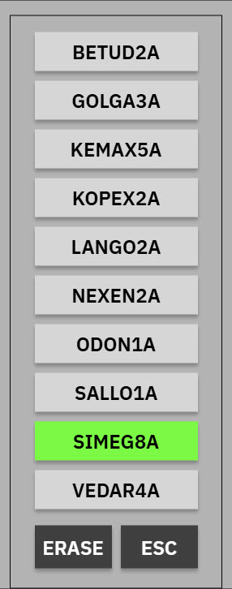
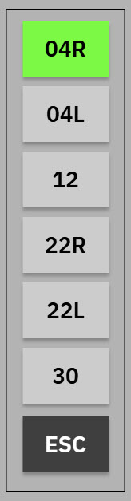
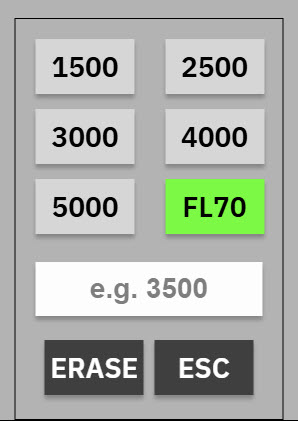

import { Aside, Steps } from '@astrojs/starlight/components';

**CLR DEL** is the scope for **EKCH_DEL** when **121.905**, **121.630**, and **121.730** are all primed. Otherwise delivery uses [SEQ PLN](/ekch/seq-pln/). Uncleared departures sit in airline bays; issuing a clearance automatically moves the strip to **Cleared**.

<Aside type="caution">
Uncleared strips cannot be manually moved to another bay — only issuing a clearance via the ATC clearance window moves them.
</Aside>

## Bay overview

| Bay | Strip type | Notes |
| --- | --- | --- |
| **Others** | Uncleared | Sorted top-down (opposite to most bays). |
| **SAS** | Uncleared | Airline grouping. |
| **Norwegian** | Uncleared | Airline grouping. |
| **Cleared** | Cleared | Strips move here after **CLD**. |
| **Messages** | Messages | Coordination / free-text. |
| **Push back** | Departure locked | Locked — context only. |
| **TWY DEP** (upper) | Departure locked | Locked. |
| **TWY DEP** (lower) | Departure locked | Locked. |

## Cleared strips

Completing a voice clearance immediately assigns the strip to SEQ PLN when **121.905** or **119.905** is primed or cross-coupled, preferring coverage of **121.905**. For PDC, ownership changes only after the pilot acknowledges. The issuing scope does not change this selection. No receiving-controller acceptance is required.

- **Any G or APRON SOUTH stand:** SEQ PLN → GE 121.830 → the applicable tower.
- **W1, RI, RII, RIII:** SEQ PLN → GW 118.580 → the applicable tower.
- **Other stands:** SEQ PLN → AD 121.730 → the configured ground/tower route. Consecutive steps carried by the same primary do not create a self-transfer.

CLR DEL on **119.905** acts as SEQ PLN when no controller carries **121.905**. If neither planner frequency is carried, SQ is skipped and the strip goes directly to the stand's **AD**, **GE**, or **GW** controller, using configured combined coverage when needed. Inheriting the SQ sector alone does not count as planner staffing. If no route or recipient can be resolved, ownership stays unchanged.

The strip remains in **Cleared** here and appears simultaneously in **STARTUP** on SEQ PLN and apron. Cross-coupled coverage assigns the controller's primary frequency as owner.

## Issue a clearance

<Steps>

1. Click the **Destination / Stand** column on the strip.

   

2. Review and update fields in the flight plan editor.

   - **Disabled** — read-only; pilots must refile to change.
   - **Dropdown** — valid options for this strip.
   - **Free-text** — e.g. **ROUTE**.

   
   
   
   

3. Click **CLD** to confirm the clearance and move the strip to **Cleared**.

</Steps>

## Pre-departure clearance (PDC / datalink)

CLR DEL only needs to act when a PDC request raises a validation or contains manual remarks.

**NEXT FRQ** uses the same stand-specific recipient selection as automatic clearance ownership, including combined and cross-coupled coverage. It is the receiving controller's primary frequency. If no route or recipient resolves, PDC cannot be issued. Ownership still changes only after pilot acknowledgment; the frequency is selected when the clearance is issued.

| State | Strip | Action |
| --- | --- | --- |
| PDC invalid | Callsign blinks grey | **OPEN DCL MENU** in the validation dialog |
| Custom PDC | Normal strip; validation prompts manual handling | **OPEN DCL MENU** |
| Cleared via PDC | Strip in Cleared with navy callsign until pilot acknowledges | — |

Use **REVERT TO VOICE** in the DCL window to abandon the datalink path.

See [Pre-departure clearance](/concepts/pre-departure-clearance/) and [Validation status](/concepts/validation-status/).

## Related

- [AA + AD](/ekch/aa-ad/) — combined apron after handoff
- [SEQ PLN](/ekch/seq-pln/) — startup sequencing
- [Apron Departure](/ekch/apn-dep/) — B/C_GND split layout
