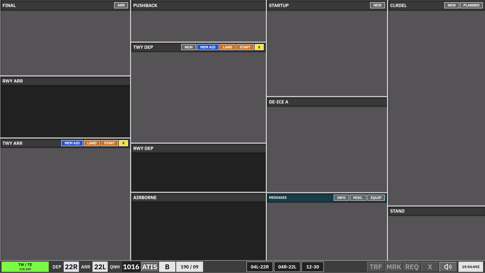

# Kastrup Ground East + West (GE + GW)

**GE + GW** is the **tower ground** scope used by **EKCH\_C\_TWR** (118.580). It uses the **TWR aspect** layout: runway and taxi logic visible to ground while coordinating with apron and delivery.

Strips live in **bays** that are **ACTIVE** or **LOCKED**. You use **REQ** where the bay allows; fully locked strip types cannot be requested.

---

## Bay overview

| Bay (as shown) | Strip type | Notes |
| --- | --- | --- |
| **Messages** | Messages | Coordination / free-text. |
| **Final** | `TWR-ARR` | Arrival finals — **force assume** = GE+GW ownership (see [TE + TW](/ekch/te-tw/) for detail). |
| **RWY ARR** | `TWR-ARR` | Runway arrival segment. **Can be REQ**. |
| **TWY ARR** | `APN-ARR` | Apron arrival taxi. **Can be REQ**. |
| **Startup** | `APNPUSH` | Cleared departures after clearance; labelled **STARTUP-TWR** in the spec. If **any apron** position is online, this bay only lists startups at stands **G110–G137**, **W1**, and **AS** (otherwise all stands). Strips appear straight after clearance from **CLR DEL** (ownership to AD) or when handed from **SEQ PLN** / **DEL+SEQ** as a split strip until assumed. |
| **Push back (TWR)** | `APNPUSH` | **PUSHBACK-TWR** — release / direction from the **pushback map** moves the strip here; pushback opens the **TWR taxi map** (not the apron map). |
| **TWY DEP (TWR)** | `TWR-DEP` | **TWY DEP-TWR** — same logical flow as **TWY DEP-LWR** on apron: the two bays stay **synchronised** but may use **different strip designs**. **Can be REQ** from **TWY DEP-LWR**. **SI** to the next sector applies. |
| **RWY DEP** | `TWR-DEP` | Departures on the runway segment. |
| **Airborne** | `TWR-DEP` | After departure. |
| **De-ice A** | `APNPUSH` | Same strip family; mostly **manual** moves between active bays. |
| **CLR DEL** | *(passive)* | Passive if **CLR DEL**, **DEL+SEQ**, or **SEQ PLN** on **AA**, **AD**, or **AA+AD** is online and selected. |
| **Stand** | `APN-ARR` | Gate / stand. **ACTIVE**. |

---

## Departures (brief)

- **Startup** → **Push back (TWR)** via pushback map; then **TWY DEP (TWR)** / **De-ice A** as needed.  
- **TWY DEP (TWR)** ↔ apron **TWY DEP-LWR** stay in sync; use **SI** and handoff rules as in the full specification.  
- **RWY DEP** and **Airborne** behaviour (including auto-move to airborne and SI) is aligned with [TE + TW](/ekch/te-tw/).

---

## Arrivals (brief)

- **TWY ARR** strips match other TWR scopes; **SI** splits follow system logic.  
- **Final** and **RWY ARR** (`TWR-ARR`) landing workflow and runway colour rules are documented under [TE + TW](/ekch/te-tw/).

---

## UNCLEARED

All **uncleared** strips sit in **CLR DEL** (no airline split in this scope), with the same behaviour as [CLR DEL](/ekch/clr-del/).

---

## Related

- [AA + AD](/ekch/aa-ad/) — combined apron scope  
- [TE + TW](/ekch/te-tw/) — tower east + west (finals, runway, airborne detail)
