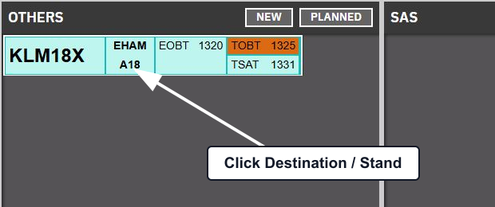
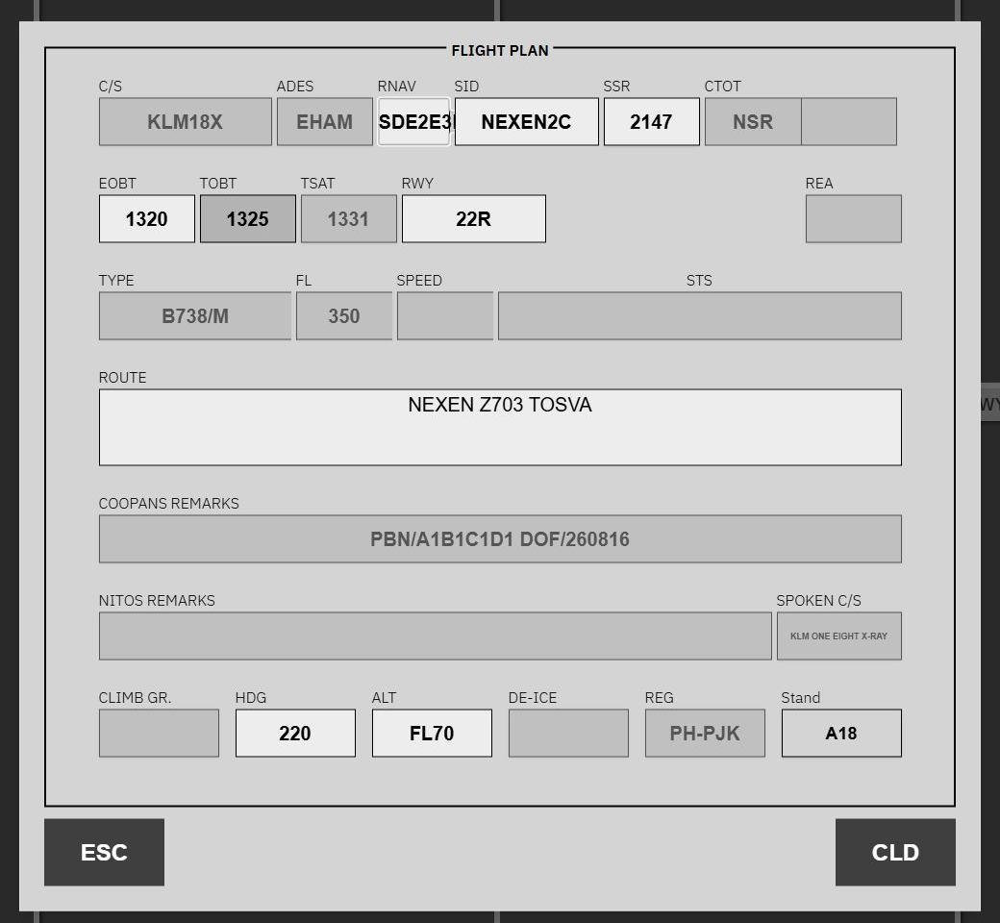
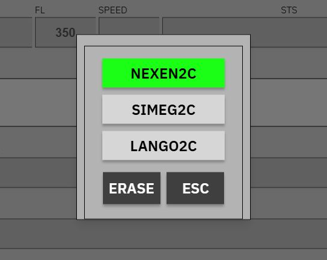
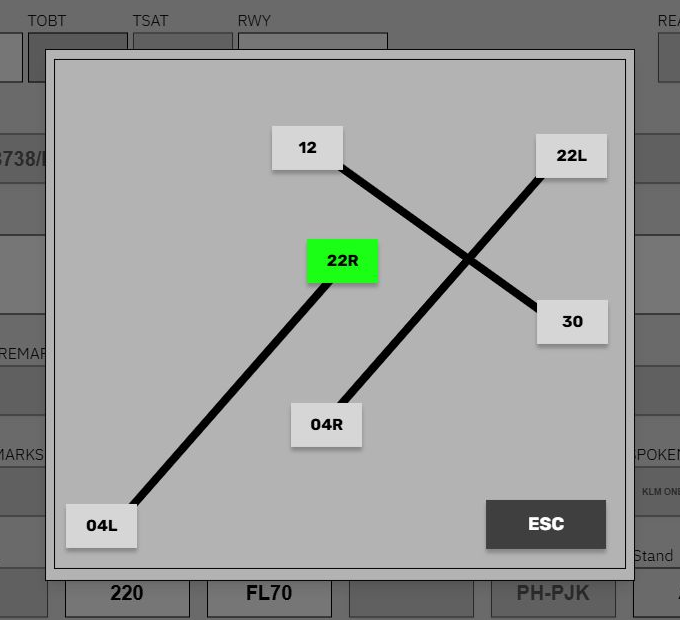
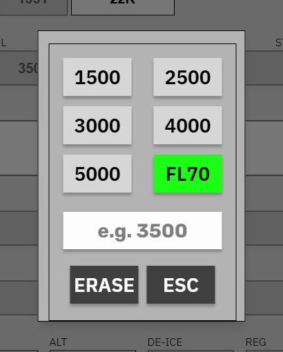
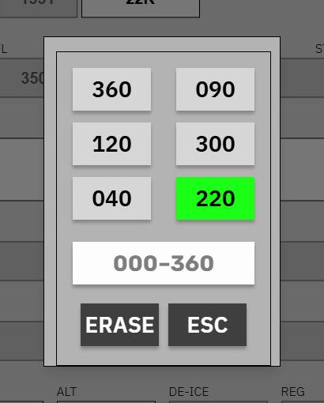
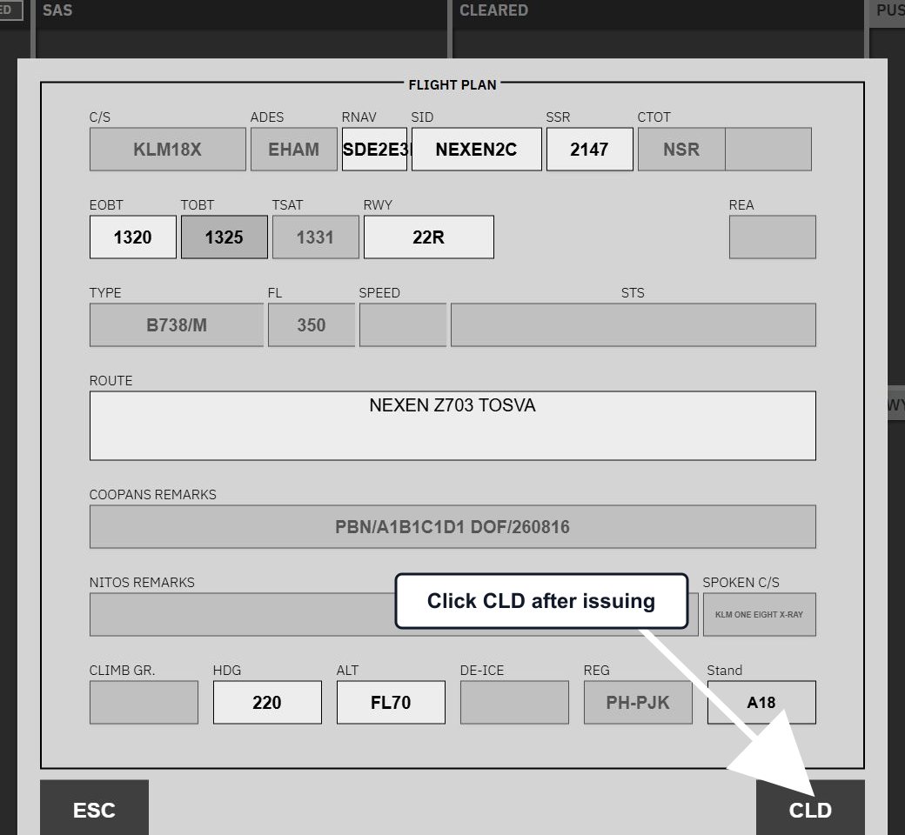
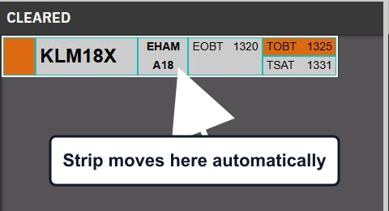

import { Aside, Steps } from '@astrojs/starlight/components';

Use the flight-plan window to check and, when necessary, correct the clearance. Flight-plan data already received by Flight Strips is shown automatically; you only need to change fields that are wrong or incomplete.

<Steps>

1. **Open the flight plan**

   Find the flight in the uncleared bay, then click its **Destination / Stand** block. This opens the flight-plan window for that strip.

   

2. **Read the automatically populated data**

   Start by checking the information that Flight Strips already displays. Callsign (**C/S**), destination (**ADES**), CTOT, TOBT, TSAT, aircraft type, requested flight level, remarks, spoken callsign, and registration are populated from the flight and are normally read-only.

   The white controls are the fields you can act on: RNAV capability, SID, SSR, EOBT, runway, route, heading, initial altitude, and stand. Change a field only when the clearance requires it.

   

3. **Assign the SID**

   Click **SID**, then select the cleared SID. The list contains the SIDs available for the assigned runway; the current selection is green. **ERASE** clears the SID and **ESC** closes the selector without changing it.

   

4. **Confirm the departure runway**

   Click **RWY** and select the runway used for this departure. The selected runway is shown in green. Changing the runway updates the strip and changes which SIDs are offered in the SID selector.

   

5. **Set the initial altitude and heading when required**

   Click **ALT** to choose a preset altitude or enter another value. If you use **ERASE**, Flight Strips falls back to the configured initial altitude for the assigned runway; if no configured value exists, it keeps the current altitude. Altitudes above the transition altitude are displayed as flight levels.

   

   Click **HDG** to choose a preset heading or enter a heading from 000 to 360. Use **ERASE** when no heading is part of the clearance.

   

6. **Check SSR, EOBT, and route**

   - Click **SSR** only when a new squawk is needed. Flight Strips requests a generated squawk and temporarily disables the button while it waits for the result.
   - Edit **EOBT** when it is wrong, then press Enter or click away to save it.
   - Edit **ROUTE** when the cleared route differs, then press Enter or click away to save it. If an ECFMP mandatory route applies, the route is shown in yellow and cannot be edited directly; Flight Strips asks you to confirm it when you click **CLD**.

7. **Issue the clearance and click CLD**

   Read the clearance to the pilot. After the clearance has been issued, click **CLD**. For a voice clearance, Flight Strips moves the strip to **CLEARED** and closes the flight-plan window.

   

   <Aside type="caution" title="CLD records the result">
     Clicking **CLD** does not read a voice clearance to the pilot. Read the clearance first, then use **CLD** to record that it has been issued.
   </Aside>

8. **Verify the result**

   Confirm that the strip appears in **CLEARED**. You do not need to drag the strip there after using **CLD**.

   

</Steps>

## When PDC or a mandatory route applies

The **CLD** action follows the state of the strip:

- For a normal voice clearance, it moves the strip to **CLEARED**.
- For a requested PDC, it issues the PDC instead. **REVERT TO VOICE** is available while a PDC is requested, including a request with validation faults.
- For a manual-PDC configuration, Flight Strips asks for confirmation before issuing the PDC.
- When an ECFMP mandatory route applies, Flight Strips opens a confirmation dialog. For a voice clearance, confirming can update the SID and route, send the mandatory route to the pilot in a private message, and move the strip to **CLEARED**.
