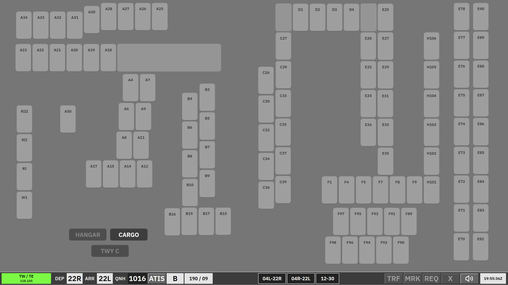

# Kastrup Sequence Planner

**SEQ PLN** is the **Sequence Planner** ground scope. It is used by **EKCH\_B\_GND** **only when EKCH\_C\_GND** (121.730) is online — B-GND takes the planner role while C-GND covers the other ground sector.

The layout uses the **GND aspect** (same family as [AA + AD](/ekch/aa-ad/) / [CLR DEL](/ekch/clr-del/)).

Strips sit in **bays** that are **ACTIVE** or **LOCKED**. This scope exposes **uncleared** work and the **Startup (sequence)** column for **cleared** traffic you hand to apron departure.

---

## Bay overview

| Bay (as shown) | Strip type | Notes |
| --- | --- | --- |
| **Messages** | Messages | Coordination / free-text. |
| **Final** | Arrival locked | **Locked** — not manipulated here. |
| **RWY ARR** | Arrival locked | **Locked**. |
| **TWY ARR** | `APN-ARR` | **Locked** in this scope. |
| **Startup (SEQ)** | Cleared | **STARTUP-SEQ** — **ACTIVE**. Same strip behaviour as the **CLEARED** bay in [CLR DEL](/ekch/clr-del/), but the bay name differs and the **SI** rules differ (see below). |
| **Push back** | `APN-PUSH` | **PUSHBACK-APN** — matches **Push back** in [AA + AD](/ekch/aa-ad/). |
| **TWY DEP** (upper / lower) | Departure locked | **TWY DEP-UPR** / **TWY DEP-LWR** — **LOCKED** here. |
| **Others** | Uncleared | Same as [CLR DEL](/ekch/clr-del/) **Others**; **ACTIVE** so you can issue clearances from here when needed. |
| **SAS** | Uncleared | Same uncleared family. |
| **Norwegian** | Uncleared | Same uncleared family. |

---

## Uncleared strips

**OTHERS**, **SAS**, and **NORWEGIAN** match [CLR DEL](/ekch/clr-del/) **uncleared** strips. They are **active** so **SEQ PLN** can clear aircraft when delivery is not the position doing it.

---

## Cleared strips — **Startup (SEQ)**

All **cleared** departures sit in the **STARTUP (SEQ)** bay. Clickspots match **CLEARED** strips under [CLR DEL](/ekch/clr-del/) (same flight plan / clearance flow).

**Transfers:**

- Manual moves are only between **Startup (SEQ)** and **Push back** within this scope.  
- **SI** is qualified for external transfer: the **SI** box shows as **white** because the strip is owned by **SEQ PLN**. The **next** sector on **SI** is always **Apron Departure (AD)** — click **SI** to split and send; **TRF** manual SI is also allowed.

---

## How SEQ PLN fits delivery and apron

From **CLR DEL** **CLEARED**, automatic **SI** handoff depends on staffing:

- **Two apron controllers or fewer:** cleared traffic **SI**s to **Apron Departure**.  
- **Three apron controllers online:** cleared traffic **SI**s to **SEQ PLN** (this scope).

If **DEL+SEQ** is selected on delivery, strips can **stay** with **EKCH\_DEL** in **CLEARED** (delivery still owns sequencing); the **SI** indicator changes (spec: white vs orange). Delivery is then responsible for moving traffic to apron when startup time is reached.

---

## Related

- [CLR DEL](/ekch/clr-del/) — clearance delivery and uncleared bays  
- [AA + AD](/ekch/aa-ad/) — full combined apron (Startup-APN, pushback, TWY DEP)  
- [Apron Departure](/ekch/apn-dep/) — B/C\_GND when apron is split
