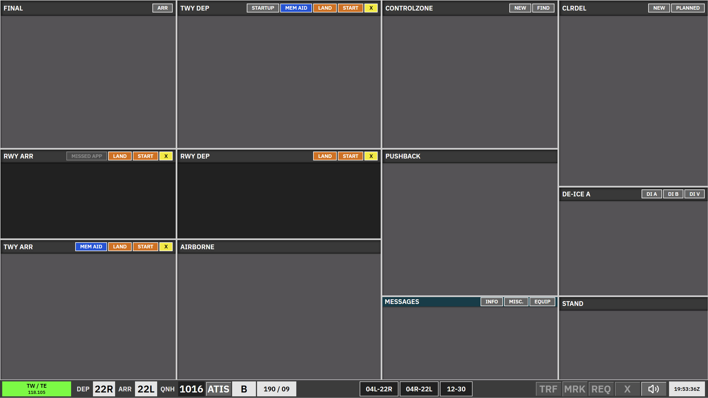

# Kastrup Tower East + West (TE + TW)

**TE + TW** is the **tower** scope for **EKCH\_A\_TWR** and **EKCH\_D\_TWR**, using the **TWR aspect** layout.

Cleared departure strips are **not listed as normal strips** in this scope: use the **Startup** bay header to open the **startup dialogue** and approve pushback when the aircraft already has its ATC clearance. If **any apron** controller is online, the startup list is limited to stands **G110–G137**, **W1**, and **AS** (same rule as [GE + GW](/ekch/ge-gw/) **Startup-TWR**).

---

## Bay overview

| Bay (as shown) | Strip type | Notes |
| --- | --- | --- |
| **Final** | `TWR-ARR` | Aircraft on final; **concerned** (purple) presentation until assumed. |
| **RWY ARR** | `TWR-ARR` | On the runway for landing. |
| **TWY ARR** | `APN-ARR` | Taxiing arrival after the runway. |
| **TWY DEP (TWR)** | `TWR-DEP` | **TWY DEP-TWR** — same role as in [GE + GW](/ekch/ge-gw/); synced with apron **TWY DEP-LWR**. **Can be REQ**. |
| **RWY DEP** | `TWR-DEP` | Holding for takeoff. |
| **Airborne** | `TWR-DEP` | After takeoff until handed off / tag assumed. |
| **Control zone** | Control zone | **VFR** strips created with **New** (new VFR FPL) or **Find** (VFR within ~20 NM). Informative only; **no** manual or auto SI transfers. |
| **Push back (TWR)** | `APNPUSH` | **Can be REQ**. |
| **Messages** | Messages | Coordination / free-text. |
| **CLR DEL** | *(passive)* | Passive when delivery + apron scopes are online as in the spec. |
| **De-ice A** | `APNPUSH` | Same strip family as other pushback/taxi strips. |
| **Stand** | `APN-ARR` | At gate / stand. |

---

## Arrivals — `TWR-ARR` (**Final**, **RWY ARR**)

- Strips appear in **Final** in the visibility area; if you cannot find one, use **ARR** in the bay header to open the **ARR dialogue**.  
- **Callsign** opens the ARR dialogue; **FORCE ASSUME** assumes the strip and prioritises it in **Final**.  
- From **Final**, **click the arrival runway** to move the strip to **RWY ARR**. Runway colour on the tag reflects **manual** move vs **runway click**, and **green** vs **red** clearance state depending on other traffic in the bay (per spec).  
- When the aircraft leaves the runway area (sensor logic), the strip moves to **TWY ARR** automatically; you can also move strips manually between bays.

---

## Departures — `TWR-DEP` (**TWY DEP-TWR**, **RWY DEP**, **Airborne**)

- **TWY DEP-TWR** matches **GE + GW** behaviour: clicking the **departure runway** moves the strip to **RWY DEP**. Runway item colours follow the same green/red logic for clearance vs multiple aircraft in the bay.  
- From **RWY DEP**, the strip moves to **Airborne** automatically when the system decides the aircraft is airborne. **SI** then targets the departure frequency; the strip leaves **Airborne** when the EuroScope tag is assumed.  
- Manual move from **RWY DEP** to **Airborne** is possible; **SI** still drives the downstream handoff.

---

## Apron arrival — **TWY ARR** (`APN-ARR`)

Same as other TWR scopes: **SI** split from **TWY ARR** per system logic; see [GE + GW](/ekch/ge-gw/) for shared clickspot ideas.

---

## Control zone

Use the bay header **New** / **Find** only for **VFR** control-zone strips. There are no strip features beyond information; transfers are not used.

---

## Related

- [GE + GW](/ekch/ge-gw/) — tower ground  
- [AA + AD](/ekch/aa-ad/) — apron combined scope
