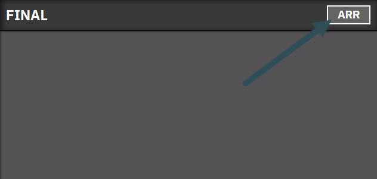

import { Image } from 'astro:assets';
import imggggg from "../../../assets/final_arr_modal.png"

When online as a `TWR` position, with `NO OTHER` stations online. \
Or `APP` forgets to transfer the tag, aircrafts does not show up automaticly in the `FINAL` bay.

<Image src={imggggg} alt="A bird." width="250px" />

Click the `CALLSIGN` of the aircraft on final to make them show up in `FINAL BAY`