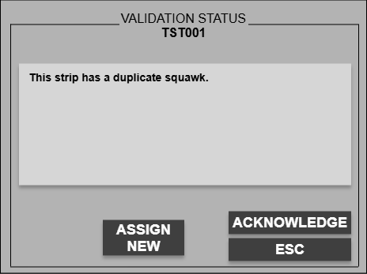
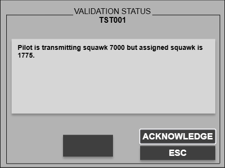
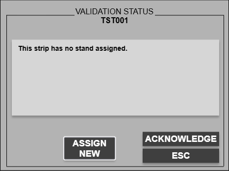
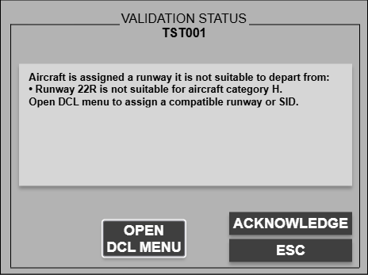
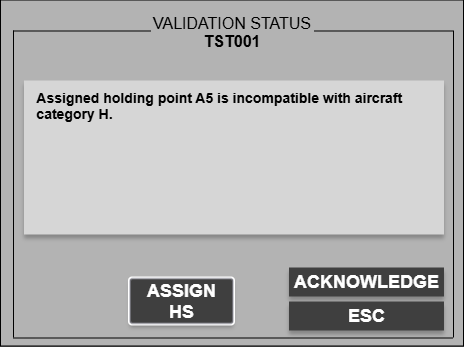
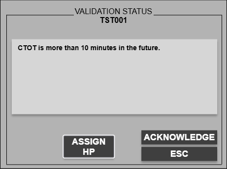

Validation status is the shared strip alert system for operational issues that must be reviewed before normal strip handling continues.

When a validation is **active**, the **callsign cell blinks grey** and clicking the callsign opens the **Validation Status** window.

## What an active validation does

While the validation is still blinking:

- You **cannot move the strip** to another bay.
- You **cannot reorder** the strip inside its bay.
- You **cannot** use strip coordination actions such as **transfer**, **assume**, **force assume**, **free**, **tag**, or **accept tag**.
- You **cannot** use blocked runway actions on that strip until the issue is acknowledged or corrected.

Use the custom button in the window when a direct correction is available. **ACKNOWLEDGE** only stops the active blink; it does **not** fix the underlying problem.

## Ownership and acknowledgement

- Most validations belong to the **owning controller** only.
- **PDC INVALID** and **CUSTOM PDC** are the exception: any online position can open and acknowledge them so someone can get into the DCL flow quickly.
- Acknowledged validations can appear again when the triggering condition changes, for example after a bay move, strip transfer, or a new backend reevaluation.

## Validation types

### Duplicate squawk

Two strips are using the same assigned squawk.

**Corrective action:** **ASSIGN NEW**

### Wrong squawk

The pilot is transmitting a different squawk than the one assigned.

**Corrective action:** Correct on frequency, then acknowledge

### PDC invalid

The PDC request contains an invalid runway or SID combination.

**Corrective action:** **OPEN DCL MENU**

### Custom PDC

The PDC request contains free-text or manual-handling remarks.

**Corrective action:** **OPEN DCL MENU**

### No stand

The strip has no stand assigned where one is required.

**Corrective action:** **ASSIGN NEW**

### Runway type

The assigned runway is not suitable for that aircraft.

**Corrective action:** **OPEN DCL MENU**

### Taxiway type

The assigned holding point is not compatible with the aircraft type/category.

**Corrective action:** **ASSIGN HS**

### CTOT

The effective CTOT is more than 10 minutes in the future.

**Corrective action:** **ASSIGN HP**

### Landing clearance

The leading arrival on final/runway arrival has not been marked cleared to land.

**Corrective action:** **CLEAR TO LAND**

## Working pattern

1. Click the blinking callsign.
2. Read the backend-authored message in **Validation Status**.
3. Use the custom action if one is offered.
4. Only acknowledge when you intentionally want to silence the active blink.

For datalink-specific strip states and PDC examples, see [Pre-departure clearance](/concepts/pre-departure-clearance/).
